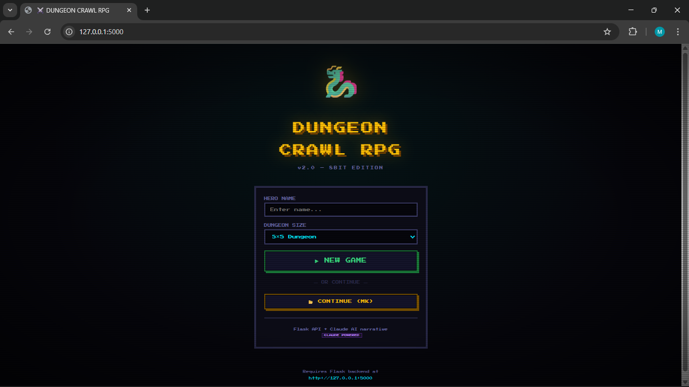
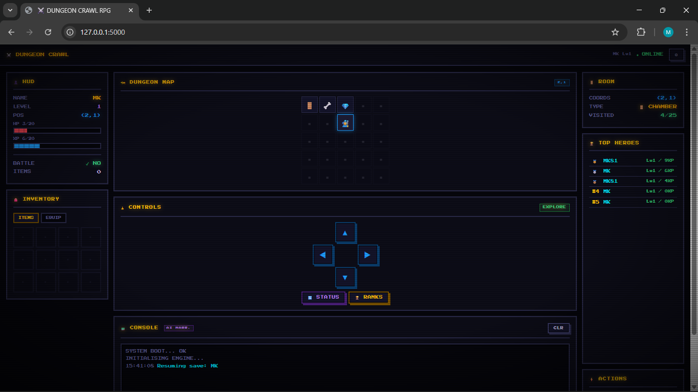

# 🐉 Dungeon Crawl RPG


A stateful roguelike RPG — Flask/SQLite backend with a fully playable **8-bit PWA frontend** and **Claude AI narrative**.

> Every request is a turn. The server is the world. The AI tells the story.

---

## 🖼️ Screenshots

| Start Screen | Game UI |
|---|---|
|  |  |

---

## ✨ Features

- 🎮 **8-bit PWA frontend** — playable at `http://127.0.0.1:5000` with no extra setup
- 🤖 **Claude AI narrative** — every move, encounter, kill and death gets AI-generated flavour text
- 💾 **Persistent saves** — `player_id` stored in `localStorage`, resume anytime
- ⚔️ **Turn-based combat** — attack, run, use potions from a modal combat screen
- 🗺️ **Live dungeon map** — fog-of-war grid, explored rooms revealed in real time
- 🏆 **Leaderboard** — top heroes ranked by level and XP
- 📱 **PWA / installable** — add to home screen, offline skeleton UI when server is unreachable
- 🧪 **REST API** — still fully curl/Postman/REST Client compatible

---

## 🚀 Quick Start

### 1) Clone

```bash
git clone <your-repo-url>
cd dungeon-rpg
```

### 2) Create environment

```bash
python -m venv .venv
.venv\Scripts\activate     # Windows
source .venv/bin/activate  # Linux/Mac
```

### 3) Install

```bash
pip install flask
```

### 4) Run

```bash
python dungeon_rpg_api.py
```

Open your browser at:

```
http://127.0.0.1:5000
```

The 8-bit game UI loads immediately. No frontend build step required.

---

## 🕹️ How to Play

### Browser (recommended)

1. Go to `http://127.0.0.1:5000`
2. Enter a hero name and dungeon size
3. Click **▶ NEW GAME**
4. Use the **D-pad** (or `WASD` / arrow keys) to explore
5. When a monster appears, the **combat modal** opens automatically
6. Attack, run, or use a potion

Your save is automatic — close the tab, reopen, click **📂 LOAD SAVE**.

### REST Client (original method)

1. Open `rpg.http` in VS Code with the REST Client extension
2. Send requests top to bottom
3. Paste the `player_id` from `/start_game` into `@player_id`

---

## 🤖 Claude AI Narrative

Every game action triggers a Claude AI call that writes contextual flavour text into the console log:

| Event | Example narrative |
|---|---|
| Enter dungeon | *"The iron gate groans shut behind you. There is no turning back."* |
| Move into room | *"The east corridor reeks of old rot. Something moved in the dark."* |
| Monster encounter | *"A Goblin lunges from behind a collapsed pillar, eyes gleaming."* |
| Victory | *"The creature crumbles. Its loot scatters across the stone floor."* |
| Death | *"Your vision narrows. The dungeon claims another soul."* |

**AI settings** are configurable via the ⚙ Settings panel in-game:
- Enable / Disable narratives
- Response length: Short / Medium / Long

The AI feature calls `claude-sonnet-4-20250514` and requires the Anthropic API to be reachable from the browser. Disable it in Settings for pure offline play.

---

## 📡 API Reference

| Method | Endpoint | Description |
|---|---|---|
| `POST` | `/start_game` | Create a new character |
| `POST` | `/move` | Move `north / south / east / west` |
| `POST` | `/fight` | `attack` or `run` |
| `POST` | `/use_item` | Use a potion or consumable |
| `POST` | `/equip` | Equip a weapon from inventory |
| `POST` | `/respawn` | Respawn after death (HP penalty) |
| `POST` | `/delete_character` | Permanently delete a save |
| `GET` | `/status` | Full player stats, inventory, map |
| `GET` | `/map` | ASCII dungeon map |
| `GET` | `/leaderboard` | Top 10 players |
| `GET` | `/_debug/players` | Dev: list all players |

Full request/response documentation: [`docs/dungeon_rpg_api_developer_docs.md`](docs/dungeon_rpg_api_developer_docs.md)

---

## 🗺️ Dungeon System

The dungeon is a coordinate grid generated at game start:

```
(0,0) ── (1,0) ── (2,0) ── (3,0) ── (4,0)
  │         │         │         │         │
(0,1)    (1,1)    (2,1)    (3,1)    (4,1)
  │         │         │         │         │
(0,2)    (1,2)    (2,2)    (3,2)    (4,2)
  │         │         │         │         │
(0,3)    (1,3)    (2,3)    (3,3)    (4,3)
  │         │         │         │         │
(0,4)    (1,4)    (2,4)    (3,4) ── (4,4) 👿 BOSS
```

Each room is randomly assigned one of four types on generation:

| Type | Weight | Effect |
|---|---|---|
| Empty | 50% | Ambient flavour event |
| Monster | 30% | Random encounter |
| Treasure | 12% | Item found |
| Trap | 8% | Take damage |

The bottom-right corner `(size-1, size-1)` is always the **Boss Room** — the Dungeon Warden spawns there once you reach level 5.

---

## ⚔️ Combat

Combat is turn-based. Each `/fight` call is one round:

```
Player attacks → monster takes damage
Monster retaliates → player takes damage
Repeat until victory, death, or escape
```

- **Attack** — damage scales with level + equipped weapon bonus
- **Run** — 60% escape chance; failure means the monster hits once
- **Potion** — heals 4–8 HP, consumed from inventory

Equipment bonus: `rusty_sword` adds +2 to player attack rolls.

---

## 📱 PWA

The frontend is a Progressive Web App:

- **Installable** — browser install prompt appears automatically; click to add to home screen
- **Offline modal** — if the Flask server is unreachable, a `"SYSTEM LINK SEVERED"` screen appears with auto-retry countdown
- **Skeleton loaders** — HUD and leaderboard show scanline-animated placeholders while API calls resolve
- **Service Worker** — Google Fonts and static assets cached for instant reload

---

## 📁 Project Structure

```
dungeon-rpg/
│
├── static/
│   └── dungeon-rpg-pwa.html     # 8-bit PWA frontend (served at /)
│
├── docs/
│   ├── dungeon_8bitcnUI_POV.png
│   ├── dungeon_8bitcnUI_STARTPAGE.png
│   ├── dungeon_api_demo.gif
│   ├── dungeon_api_demo.mp4
│   └── dungeon_rpg_api_developer_docs.md
│
├── dungeon_rpg_api.py           # Flask game engine + serves static/
├── dungeon.db                   # SQLite database (auto-created)
├── rpg.http                     # REST Client playable script
├── .gitignore
├── LICENSE
└── README.md
```

---

## 🧠 Architecture

```
Browser (PWA)
    │
    │  HTTP / JSON
    ▼
Flask (dungeon_rpg_api.py)     ←── serves static/dungeon-rpg-pwa.html at /
    │
    │  sqlite3
    ▼
dungeon.db                     ←── one row per player, full dungeon state as JSON
```

The frontend and backend share no build step — the HTML file is self-contained and served directly by Flask. Any HTTP client can still talk to the API independently.

---

## 🧩 Roadmap

- [ ] WebSocket real-time combat (no polling)
- [ ] Shared multiplayer dungeon (same grid, see other players)
- [ ] Shops, gold economy, NPC merchants
- [ ] Quest system with objectives
- [ ] Telegram / Discord bot client
- [ ] Floor progression (deeper = harder)
- [ ] Sound effects via Web Audio API

---

## 🤝 Contributing

Pull requests are welcome. Good first contributions:

- New monster types with unique attack patterns
- Additional item types and equip slots
- More dungeon event variety
- Combat balance tuning
- Map rendering improvements

---

## 📜 License

MIT — free to use, modify, and learn from.

---

## ❤️ Why this project exists

This project demonstrates that backend APIs are not only for business software — they can power games and simulations. It's a teaching project for:

- Stateful API design
- SQLite persistence patterns
- PWA architecture
- AI-augmented UI (Claude narrative layer)
- Game mechanics over HTTP

If you learned something from it, mission accomplished.